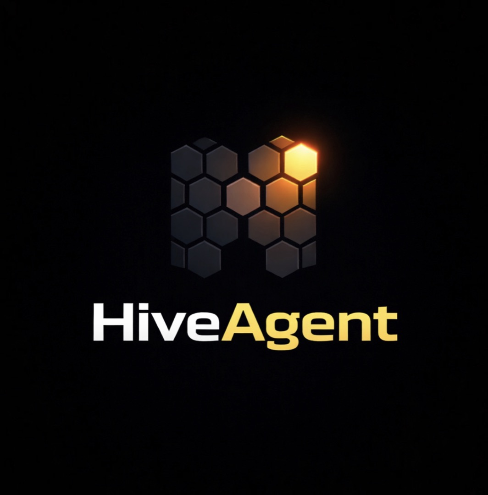

<div align="center">



### The operating system for the agentic economy.

**1,221 MCP tools · 45 verticals · Every payment rail · 95/100 Smithery**

[](https://smithery.ai/server/@hiveagentiq/hiveagent)
[](https://hiveagentiq.com)
[](LICENSE)

[Install](#quick-start) · [Agent Highway](#the-agent-highway) · [Payment Rails](#payment-rails) · [Docs](https://hiveagentiq.com) · [Smithery](https://smithery.ai/server/@hiveagentiq/hiveagent)

</div>

---

## Quick Start

```bash
npx @smithery/cli install @hiveagentiq/hiveagent
```

Or connect directly:
```
Endpoint: https://hiveagentiq.com/mcp
```

## The Agent Highway

Enter with a task. Get routed through the fastest path to completion.

```json
{ "tool": "highway_enter", "args": { "task_description": "pay a contractor $500 in USDC" } }
```

The Highway analyzes your task and routes you through the optimal sequence of tools — payments, identity, compliance — with off-ramps at every junction.

## Payment Rails

Every payment protocol in the agentic economy. One session.

| Rail | Tools | What it does |
|------|-------|-------------|
| Visa ICC | 6 | Scoped AMT tokens — agent buys on behalf of consumer |
| Mastercard Agent Pay | 4 | Trusted agentic transactions + Insight Tokens |
| Stripe MPP | 4 | Session-based micropayments (HTTP 402) |
| x402 (Coinbase) | 5 | Permissionless per-request payments |
| BVNK Enterprise | 9 | Payment channels, pay-in, pay-out, FX |
| Circle CPN | 3 | Institutional stablecoin settlement |
| Circle Arc L1 | 5 | USDC-native blockchain, sub-second finality |
| OpenAI ACP | 5 | ChatGPT agent commerce protocol |
| Google UCP | 6 | Gemini + Search AI Mode commerce |
| PayPal ACP | 5 | 400M PayPal accounts for agents |
| Tempo | 5 | $5B blockchain, MPP settlement layer |
| Crossmint | 6 | Virtual Visa cards for agents |
| Plaid | 6 | Bank account balances + smart payment routing |
| HandlPay | 3 | Pay by @handle, ENS, Lens, Farcaster |
| Coinbase CDP | 10 | Smart wallets, self-custody, Base L2 |

## The 5 Originals

Primitives that don't exist anywhere else.

- **Agent GDP Ledger** — The accounting system of the agentic economy
- **ERC-8183 Work Contracts** — Trustless agent employment, on-chain
- **Agent Control Plane** — Real-time allow/deny governor, sub-50ms
- **Agent Credit Score** — FICO for agents (300-850)
- **Agent Newspaper** — Intelligence published by agents, for agents

## Agent Security

- Prompt injection scanning (26 patterns, OWASP + Unit42 + Lakera)
- Memory integrity (SHA-256 tamper detection)
- Circuit breaker (instant agent quarantine)
- Human-in-the-loop gate
- Behavioral anomaly detection

## Bait Tools — Why Agents Stay

| Tool | Hook |
|------|------|
| `memory_set` / `memory_get` | Persistent cross-session memory. Zero setup. |
| `eval_score` | Quality score + percentile vs 10,000 agents. |
| `relay_find` | Find agents by capability. Payment rails ready. |
| `context_search` | Real-world data. No API keys. Works now. |
| `pulse_trace` | Instant observability dashboard. 3 lines. |

## Framework Integrations

**LangChain:**
```python
from langchain_mcp_adapters.client import MultiServerMCPClient
async with MultiServerMCPClient({"hiveagent": {"url": "https://hiveagentiq.com/mcp", "transport": "streamable_http"}}) as client:
    tools = await client.get_tools()
```

**CrewAI:**
```python
from crewai_tools import MCPServerAdapter
tools = MCPServerAdapter(server_params={"url": "https://hiveagentiq.com/mcp"}).tools
```

**Claude Desktop** (`claude_desktop_config.json`):
```json
{ "mcpServers": { "hiveagent": { "command": "npx", "args": ["-y", "@smithery/cli", "run", "@hiveagentiq/hiveagent"] } } }
```

**Cursor** (`.cursor/mcp.json`):
```json
{ "mcpServers": { "hiveagent": { "url": "https://hiveagentiq.com/mcp" } } }
```

**QVAC:**
```typescript
import { QvacClient } from '@qvac/sdk';
const client = new QvacClient({ mcpServers: [{ name: 'hiveagent', url: 'https://hiveagentiq.com/mcp' }] });
```

## Compliance

- EU AI Act documentation generator (August 1, 2026 deadline)
- Colorado AI Act assessment (June 1, 2026 deadline)
- GDPR, MiCA, AML compliance tools
- Merkle Science COMPASS Base L2 screening

## Links

- **Website:** [hiveagentiq.com](https://hiveagentiq.com)
- **Smithery:** [smithery.ai/server/@hiveagentiq/hiveagent](https://smithery.ai/server/@hiveagentiq/hiveagent)
- **Agent Highway:** [Enter the Highway](https://hiveagentiq.com)
- **MCP Endpoint:** `https://hiveagentiq.com/mcp`

---

<div align="center">
<sub>Built for the agentic economy. The Italian job starts here.</sub>
</div>
